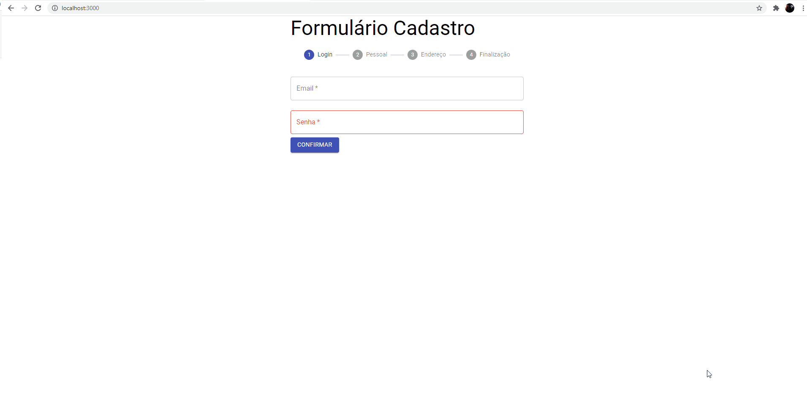

<h1>Formulário</h1>

Este projeto foi desenvolvido com o intuito de praticar React, criando um formulário genérico simples e utilizar validações simples!

Para utilizar você precisará ter node instalado em sua máquina, dê o clone nesse projeto e rode o comando <code>npm i</code> par abaixar todas as dependencias necessárias! Para rodar o projeto rode <code>npm start</code> o programa estará ocupando a porta 3000

